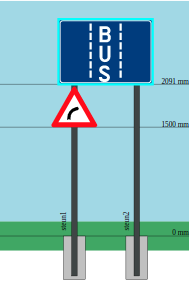

# Omschreven rechthoek
De omschreven rechthoek van een bord is de kleinst mogelijke rechthoek waarbinnen het bord past. 
In het geval van een rechthoekig bord is dit heel simpel: 
```xml
    <bord>
      <type>F17</type>
      <vorm>rh</vorm>
      <afmeting1>1300.0</afmeting1>
      <afmeting2>900.0</afmeting2>
      <omschrevenRechthoek>
        <breedte>1300.0</breedte>
        <hoogte>900.0</hoogte>
      </omschrevenRechthoek>
    </bord>
```
Voor een driehoekig bord wordt het al ingewikkelder:
```xml
    <bord>
      <type>A1b</type>
      <vorm>dh</vorm>
      <afmeting1>700.0</afmeting1>
      <afmeting2>0.0</afmeting2>
      <omschrevenRechthoek>
        <breedte>634.0</breedte>
        <hoogte>561.0</hoogte>
      </omschrevenRechthoek>
    </bord>
```
De omschreven rechthoek van een opstelling/aanzicht is dan analoog de kleinst mogelijke rechthoek waarbinnen alle borden van die opstelling/aanzicht passen.

# Voorstelling
Dit stukje bepaalt hoe de voorstelling van de opstelling/aanzicht op de kaart eruit ziet. Dit is de platgeslagen voorstelling zonder de steunen. Gaten tussen de borden zijn hier ook uitgehaald.

Dit is de positie van de linker-beneden hoek van de omschreven rechthoek van het bord, binnen de omschreven rechthoek van de platgeslagen voorstelling.

Bijvoorbeeld: 

Voor deze voorstelling: 


Hebben we deze platgeslagen voorstelling op kaart:


Deze platgeslagen voorstelling krijgen we door de volgende code:

```xml
    <bord>
      <type>F17</type>
      <vorm>rh</vorm>
      <afmeting1>1300.0</afmeting1>
      <afmeting2>900.0</afmeting2>
      <omschrevenRechthoek>
        <breedte>1300.0</breedte>
        <hoogte>900.0</hoogte>
      </omschrevenRechthoek>
      <voorstelling>
        <x>0.0</x>
        <y>591.0</y>
      </voorstelling>
    </bord>
    <bord>
      <type>A1b</type>
      <vorm>dh</vorm>
      <afmeting1>700.0</afmeting1>
      <afmeting2>0.0</afmeting2>
      <omschrevenRechthoek>
        <breedte>634.0</breedte>
        <hoogte>561.0</hoogte>
      </omschrevenRechthoek>
      <voorstelling>
        <x>0.0</x>
        <y>0.0</y>
      </voorstelling>
    </bord>
```

We zien hier duidelijk dat het A1b bord beneden hangt *(y = 0.0)* en het F17 bord hoger *(y = 591)*. 

Verder zien we dat de twee borden mooi links gealigneerd staan *(x = 0)*.

Merk op dat waardes ook negatief mogen zijn, we kijken naar de verschillen tussen de waardes.

# Opstelling
Dit stukje bepaalt dan hoe de opstelling/aanzicht er in de editor eruit ziet. Dit is met alle gaten, opstelhoogte, verschuivingen en eventuele steunen.

Positie van de linker-beneden hoek van de omschreven rechthoek van het bord, binnen de opstelling. Het nulpunt van de opstelling, is het middenpunt van de opstelling op het grondniveau.

Voor de bovenstaande opstelling krijgen we dan bv:

```xml
    <bord>
      <type>F17</type>
      <vorm>rh</vorm>
      <afmeting1>1300.0</afmeting1>
      <afmeting2>900.0</afmeting2>
      <omschrevenRechthoek>
        <breedte>1300.0</breedte>
        <hoogte>900.0</hoogte>
      </omschrevenRechthoek>
      <opstelling>
        <x>-650.0</x>
        <y>2091.0</y>
      </opstelling>
    </bord>
    <bord>
      <type>A1b</type>
      <vorm>dh</vorm>
      <afmeting1>700.0</afmeting1>
      <afmeting2>0.0</afmeting2>
      <omschrevenRechthoek>
        <breedte>634.0</breedte>
        <hoogte>561.0</hoogte>
      </omschrevenRechthoek>
      <opstelling>
        <x>-650.0</x>
        <y>1500.0</y>
      </opstelling>
    </bord>
```

Hier zien we dat het A1b bord een opstelhoogte van 1500mm heeft *(y = 1500.0)* en het F17 bord 591mm hoger staat *(y = 2091.0)*. Dit is exact de hoogte van de omschreven rechthoek van het A1b bord *(hoogte = 561.0)* met 30mm tussenruimte.

Omdat beide borden links gealigneerd zijn, hebben ze dezelfde x waarde *(x = -650.0)*, Aangezien het nulpunt het middenpunt van de opstelling is en de opstelling 1300 mm bredd is (de breedte van het F17 bord), is het logisch dat de linkherhoek van beide borden de waarde -650 heeft (1300 / 2).

# Steunen
Het is ook mogelijk om steunen op te geven in de import file. Omdat steunen niet voorkomen in de platgeslagen voorstelling op de kaart, moeten we hier maar 1 set van coordinaten per steun opgeven.

Ook hier, het nulpunt van de opstelling is het middenpunt van de opstelling op het grondniveau.

Een voorbeeld:

```xml
    <bord>
      <type>A1b</type>
      <vorm>dh</vorm>
      <afmeting1>700.0</afmeting1>
      <afmeting2>0.0</afmeting2>
      <omschrevenRechthoek>
        <breedte>634.0</breedte>
        <hoogte>561.0</hoogte>
      </omschrevenRechthoek>
      <opstelling>
        <x>-746.5</x>
        <y>1500.0</y>
      </opstelling>
    </bord>
    <bord>
      <type>F17</type>
      <vorm>rh</vorm>
      <afmeting1>1300.0</afmeting1>
      <afmeting2>900.0</afmeting2>
      <omschrevenRechthoek>
        <breedte>1300.0</breedte>
        <hoogte>900.0</hoogte>
      </omschrevenRechthoek>
      <opstelling>
        <x>-649.5</x>
        <y>2091.0</y>
      </opstelling>
    </bord>
    <steun>
      <lengte>3316.0</lengte>
      <coordinaat>
        <x>-429.5</x>
        <y>0.0</y>
      </coordinaat>
      <cirkel>
        <diameter>76.0</diameter>
        <wanddikte>2.9</wanddikte>
      </cirkel>
    </steun>
    <steun>
      <lengte>3316.0</lengte>
      <coordinaat>
        <x>430.5</x>
        <y>0.0</y>
      </coordinaat>
      <cirkel>
        <diameter>76.0</diameter>
        <wanddikte>2.9</wanddikte>
      </cirkel>
    </steun>
```

Dit geeft ons deze opstelling: 


We zien dat het A1b bord *(x = -746.5)* meer naar links hangt dan het F17 bord *(x = -649.5)*. Dit komt omdat het midden van het A1b bord op de eerste steun hangt.*(-429.5 - (634.0 / 2) = -746.5)*

We zien ook dat het F17 bord zowel links als rechts 220mm over de steunen hangt.

Indien steunen gebruikt worden, is het belangrijk dat de coordinaten kloppen. De coordinaten worden nl. gebruikt om te bepalen welk bord aan welke steun(en) hangt.

Wanneer de omschreven rechthoek van een bord overlapt met de omschreven rechthoek van een steun, dan veronderstellen we dat dat bord aan die steun hangt.

