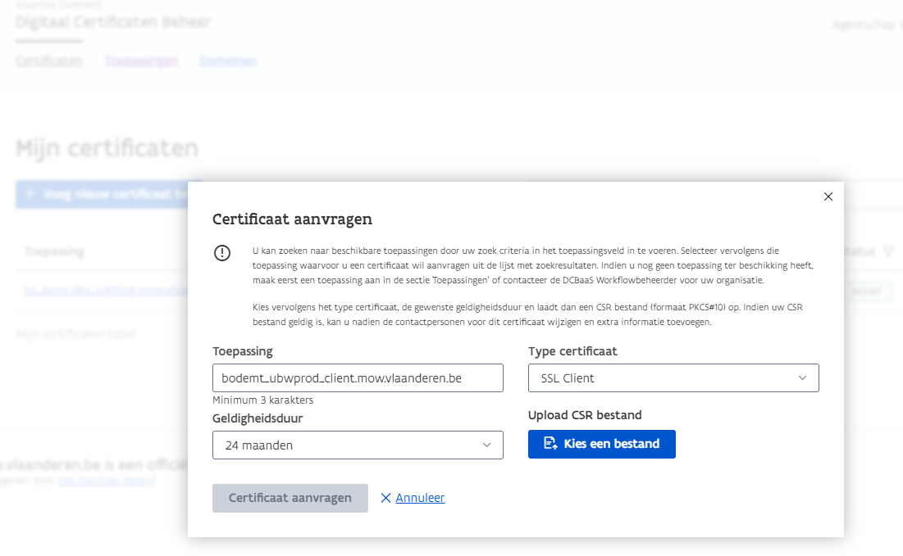
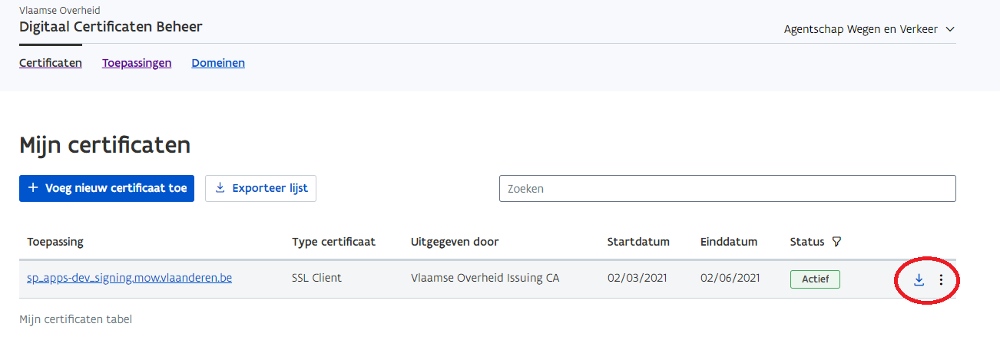

# verkeersborden-sync
Documentatie en schema file om een sync vanuit een externe applicatie (EXT) met de verkeersborden applicatie (VKB) op te zetten.

## EXT is master
De sync van EXT naar VKB, waarbij EXT de eigenaar van de data is, is op dit moment een PUSH vanuit de externe applicatie naar VKB.
Hierbij worden de opstellingen die in VKB bestaan overschreven met deze in de import.

### Setup
Voor er gestart kan worden met het testen, met er langs de kant van VKB wel wat setup gebeuren.

Stuur daarvoor de naam van de organisatie (gemeente/provincie/...) en applicatie door via email. Deze zal dan in VKB gemarkeerd worden als een extern beheerde organisatie, waardoor er in VKB geen wijzigingen op de opstellingen van deze organisatie kunnen gebeuren, wat ons toelaat om een enkel richting sync te gebruiken.

Dan moet er een certificaat aangemaakt en geregistreerd worden. De procedure daarvoor is als volgt:

#### DCB

Partners moeten zelf een domein en certificaat aanvragen in: https://dcb.vlaanderen.be/.

Meer info via deze link: https://overheid.vlaanderen.be/publicaties-toegangs-en-gebruikersbeheer#ik-heb-vragen-over-vo-dcb-of-vodcbaas

Hiervoor moet je toegangsrechten krijgen. Laat de IDM lokale beheerder ([Patrick Van Acker](mailto:patrick.vanacker@mow.vlaanderen.be), [Bert Weyne](mailto:bert.weyne@mow.vlaanderen.be), [Tim De Planter](mailto:tim.deplanter@mow.vlaanderen.be) of andere AWV ICA of ICT functiehouders) het VO DCB recht voor je in orde zetten.

#### Naamgeving certificaat (CN)
Je moet een zinnige naam kiezen om in je certificaat te gebruiken. Dit is meestal een combinatie van de naam van jouw toepassing, de naam van de toepassing waar je toegang tot wil krijgen, de omgeving en het domein van onze toepassing (meestal ‘awv.vlaanderen.be’)

bvb. Om communicatie van de abbamelda applicatie naar de eminfra toepassing te signen in de development omgeving: abbamelda_eminfra_dev.awv.vlaanderen.be

#### Maak je private key en csr aan
Nu moet je de gekozen CN gebruiken om een private key en csr aan te maken:
```
openssl req -nodes -newkey rsa:4096 -keyout abbamelda_eminfra_dev.awv.vlaanderen.be.key -out abbamelda_eminfra_dev.awv.vlaanderen.be.csr -subj "/emailAddress=devops@project.wegenenverkeer.be/C=BE/ST=Brussels/L=Brussels/O=Agentschap Wegen en Verkeer/CN=abbamelda_eminfra_dev.awv.vlaanderen.be"
```
Uiteraard gebruik je je eigen mailadres en gegevens voor de naamgeving.

Indien nodig, kan je ook een certificaat met slashes in de CN aanmaken:
```
openssl req -nodes -newkey rsa:4096 -keyout awv.vlaanderen.be_omgevingsvergunning-test.key -out awv.vlaanderen.be_omgevingsvergunning-test.csr -subj "/CN=awv.vlaanderen.be/omgevingsvergunning-test,emailAddress=devops@project.wegenenverkeer.be,O=Agentschap Wegen en Verkeer /OU=ICT cel PCO - DevOps team,L=Brussels,ST=Brussels,C=BE"
```

#### Laad je gemaakte csr op in VO DCB en download certificaat
1. Laad je gemaakte csr op in VO DCB https://dcb.vlaanderen.be/ en voeg details toe



2. Download de client certificaten en lever het samen met de key en csr aan je ontwikkelteam op een veilige manier.



3. Controles:
Een eerste controle die kan gebeuren is of de files matchen ( csr, key en der file )

```
openssl req -noout -modulus -in abbamelda_eminfra_dev.awv.vlaanderen.be.csr | openssl md5
openssl rsa -noout -modulus -in abbamelda_eminfra_dev.awv.vlaanderen.be.key | openssl md5
openssl x509 -noout -modulus -in abbamelda_eminfra_dev.awv.vlaanderen.be.der -inform der | openssl md5
```
Het resultaat van bovenstaande commando's is telkens een cijferreeks, deze moet voor de 3 files dezelfde zijn !!!

bvb:
```
(stdin)= a8d230b833ffb1c8a8b8936b0bc19bf0
(stdin)= a8d230b833ffb1c8a8b8936b0bc19bf0
(stdin)= a8d230b833ffb1c8a8b8936b0bc19bf0
```
4. Verwijder vervolgens de certificaten bij jezelf.

#### Toegangsrechten goed laten zetten
Bezorg je CN aan [Tim De Planter](mailto:tim.deplanter@mow.vlaanderen.be) en laat hem je toegangsrechten tot de applicatie goed zetten.

Wanneer dat in orde is, zou je toegang moeten hebben tot de applicatie.

Per organisatie hebben we 1 certificaat nodig, dus indien uw applicatie meerdere organisaties beheert, moet u de sync zelf opsplitsen en het juiste certificaat gebruiken.

Al de communicatie gebruikt REST calls met JSON data wanneer toepasselijk.

Via deze request kan u checken of de connectie en permissies werken:

```HTTP
GET https://services.apps-dev.mow.vlaanderen.be/verkeersborden/rest/gebruikerbeperkingen?laag=VerkeersbordOpstelling
Accept: application/vnd.awv.wdb-v3.0+json
```

Dit moet een toelating voor uw organisatie teruggeven.

### Opladen data:

Al de volgende operaties gebeuren t.o.v. de volgende url https://services.apps-dev.mow.vlaanderen.be/verkeersborden

:warning: **Let op, de zip-file mag niet te groot zijn, maximaal 100MB. Indien u meer opstellingen wilt opladen, moet u zelf meerdere oplaad calls doen met kleinere zip-files**

Importeren is een asynchrone operatie, daarom is er een transactie sleutel nodig om de operatie te kunnen opvolgen.

#### Transactie-sleutel opvragen:

```HTTP
POST /rest/verkeersborden/opstelling/transactie
Accept: application/vnd.awv.wdb-v3.0+json
```

Dit geeft een sleutel (string) terug die in de volgende call gebruikt kan worden. Deze sleutel kan maar 1 keer gebruikt worden om een file op te laden. U moet iedere keer een nieuwe sleutel opvragen.

#### Opladen zip-file:

```HTTP
POST /rest/verkeersborden/opstelling/upload/{sleutel}
Content-Type: multipart/form-data
```

zip-file zit in field met naam ``zipFile``

Formaat van zip-file: export.xml en svg files. Zie [Export-awv.xsd](Export-awv.xsd) voor schema van export.xml (met uitleg) en [Coordinaten.md](Coordinaten.md) voor meer uitleg over het coordinaten systeem van de voorstelling en opstelling.

Opstellingen kunnen simpel verwijderd worden door ``teverwijderen`` op ``true`` te zetten.

[Dit](verkeersborden.zip) is een voorbeeld van een zip-file.

Dit doet een upload van de data en start een import in de achtergrond.

#### Opvragen status van import:

```HTTP
GET /rest/audit/transactions/{sleutel}
Accept: application/vnd.awv.wdb-v3.0+json
```

Geeft JSON terug

```JSON
{
    "transactionResult": "",
    "errorTrace": "",
    "creationDate": "",
    "ldapId": "",
    "transactionId": "",
    "transactionType": "",
    "transactionName": "",
    "transactionStatus": "SUCCESS | EXECUTING | FAILED",
    "details": [
      {
        "identifier": "",
        "status": "WAITING | SUCCESS | INPROGRESS | FAIL | SKIPPED",
        "error": "",
        "warning": ""
      }
    ]
}
```

Details is een array van de opstellingen in de XML file. Identifier is dan de uid uit de XML file.
Error en warning zijn optioneel en geven de reden van de fout of waarschuwing weer.
Status gaat van WAITING naar SKIPPED of INPROGRESS en dan naar SUCCESS of FAIL.

Omdat het opladen een asynchrone operatie is, kan het zijn dat deze call na het starten van het opladen van de file een 404 http-status teruggeeft. Probeer dan later opnieuw. Als de service grote load heeft, kan dit potentieel lang duren.

Buiten de 404 http-status krijg je ook nog een json terug met deze vorm:

```JSON
{
    "error": "Er bestaat geen transactie met transactie ID xxxxxxxxxx"
}
```
